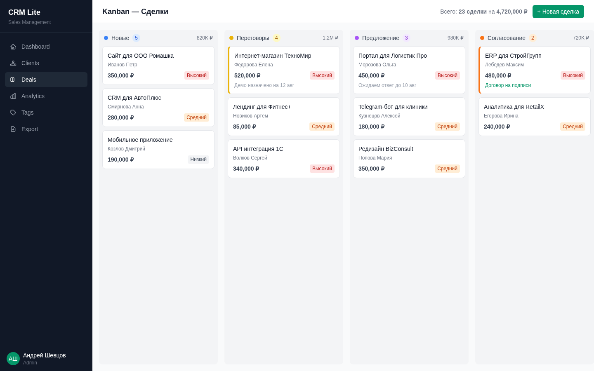
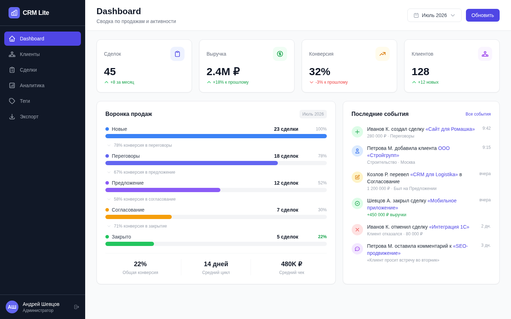

<!--
  BANNER: см. github_resume/DESIGN_SYSTEM.md — CRM Lite
  Сохранить как assets/banner.png и раскомментировать:
-->
<!--  -->

<div align="center">

> **[English version](README_EN.md)**

# CRM Lite

### Легковесная CRM для растущих команд

[](https://github.com/AndrewSheff/crm-lite/actions)
[](https://python.org)
[](https://fastapi.tiangolo.com)
[](https://react.dev)
[](https://typescriptlang.org)
[](https://postgresql.org)
[](https://docker.com)
[](LICENSE)

**Управляйте клиентами, отслеживайте сделки на канбан-доске, анализируйте воронку продаж и получайте рекомендации от ИИ — self-hosted, без ежемесячных платежей.**

[Быстрый старт](#быстрый-старт) · [Возможности](#возможности) · [Скриншоты](#скриншоты) · [Архитектура](#архитектура) · [API](#документация-api)

</div>

---

> **Проблема:** Малый бизнес ведет клиентов в Excel, сделки — в блокноте, задачи — в голове. Корпоративные CRM стоят $50-150/user/мес и требуют недель настройки. Когда менеджер уходит — вся история контактов исчезает.

**CRM Lite** — self-hosted CRM, которая разворачивается за 5 минут. Канбан-доска для наглядного управления сделками, аналитика воронки продаж, ИИ-ассистент с рекомендациями и импорт из Excel для мгновенной миграции с таблиц.

<div align="center">

| Строк кода | Эндпоинтов API | Моделей БД | Страниц | Тестов | Сервисов Docker |
|:---:|:---:|:---:|:---:|:---:|:---:|
| **10 000+** | **47** | **9** | **15** | **8 файлов** | **5** |

</div>

---

## Скриншоты

| Канбан-доска | Дашборд |
|:------------:|:-------:|
|  |  |

---

## Возможности

**Канбан-доска сделок** — наглядный пайплайн с drag & drop (@dnd-kit). Перетаскивайте сделки между стадиями, смотрите индикаторы выигрыша/проигрыша, фильтруйте по приоритету. Счетчики и суммы по стадиям в реальном времени.

**Управление клиентами** — полный CRUD с поиском, фильтрацией и цветными тегами. Контроль доступа по владельцу. История контактов и связанные сделки в одном месте.

**Аналитика воронки продаж** — дашборд с трендами выручки, воронкой конверсии, средним размером сделки и процентом побед. Лента активности с действиями команды в реальном времени.

**ИИ-ассистент** — Claude или GPT анализирует сделки и рекомендует лучшее следующее действие. Оценка рисков, вероятность закрытия и предлагаемая стратегия дальнейших шагов.

**Активности и заметки** — фиксируйте звонки, встречи, письма и задачи с дедлайнами. Закрепляйте важные заметки к сделкам. Полная лента активности по каждому клиенту и сделке.

**Импорт/экспорт Excel** — массовая миграция из таблиц с маппингом столбцов и обнаружением дублей. Экспорт клиентов и сделок в XLSX для отчетности.

**Настраиваемый пайплайн** — задавайте собственные стадии (Новая, Переговоры, Предложение, Закрыта/выиграна и т.д.) с цветами и порядком. Адаптируйте под любой процесс продаж.

**Ролевой доступ** — Администратор (полный доступ), Менеджер (свои клиенты и сделки), Наблюдатель (только чтение). JWT-аутентификация с refresh-токенами.

**Корпоративная безопасность** — хеширование паролей через bcrypt, rate limiting, настройка CORS, структурированное JSON-логирование с трассировкой запросов.

---

## Архитектура

```
┌──────────────────────────────────────────────────┐
│                  Nginx :80                        │
│           Обратный прокси + Заголовки             │
├──────────────────┬───────────────────────────────┤
│  Фронтенд :3000  │        Бекенд :8000            │
│  React 19 + Vite │     FastAPI + Uvicorn          │
│  TailwindCSS v4  │     SQLAlchemy 2.0 (async)     │
│  @dnd-kit Канбан │   ┌────────────────────────┐   │
│  Recharts        │   │    Бизнес-логика        │   │
│  15 страниц      │   │  Клиенты · Сделки · ИИ  │   │
│                  │   │  Активности · Экспорт   │   │
│                  │   └────────────────────────┘   │
├──────────────────┴───────────────────────────────┤
│   PostgreSQL 16              Redis 7              │
│   9 моделей, Alembic         Rate Limiting        │
│   Индексы, FK                Кеш сессий           │
└──────────────────────────────────────────────────┘
```

### Поток данных канбан-доски

```
Пользователь перетаскивает карточку сделки
        |
        v
  [@dnd-kit DragEnd]
        |
        v
  PATCH /api/v1/deals/{id}
  { "stage_id": new_stage }
        |
        v
  [Бекенд проверяет переход]
  [Обновляет сделку + создает запись в ленте активности]
        |
        v
  [React Query сбрасывает кеш]
  [Канбан перерисовывается с новой позицией]
```

---

## Быстрый старт

### Требования
- Docker & Docker Compose v2+
- (Опционально) API-ключ Anthropic или OpenAI для ИИ-ассистента

### 1. Клонирование и настройка

```bash
git clone https://github.com/AndrewSheff/crm-lite.git
cd crm-lite
cp .env.example .env
```

Отредактируйте `.env`:

```env
SECRET_KEY=your-random-64-char-string    # обязательно
ADMIN_PASSWORD=SecurePass123             # обязательно
ANTHROPIC_API_KEY=sk-ant-...             # опционально, для ИИ-ассистента
```

### 2. Запуск

```bash
docker compose up -d
```

### 3. Доступ

| Сервис | URL |
|:-------|:----|
| Приложение | http://localhost |
| Документация API (Swagger) | http://localhost/docs |

Войдите с учетными данными администратора из `.env`.

---

## Технологический стек

| Слой | Технология | Версия |
|:-----|:-----------|:-------|
| **Бекенд** | Python, FastAPI, SQLAlchemy (async), Alembic | 3.13, 0.115, 2.0 |
| **Фронтенд** | React, TypeScript, Vite, TailwindCSS, shadcn/ui | 19, 5+, 6, v4 |
| **Канбан** | @dnd-kit (drag & drop) | Latest |
| **Графики** | Recharts | 2.15 |
| **База данных** | PostgreSQL | 16 |
| **Кеш** | Redis | 7 |
| **ИИ** | Anthropic Claude, OpenAI GPT | Latest |
| **Экспорт** | openpyxl | XLSX |
| **Авторизация** | JWT (access + refresh) + bcrypt | HS256 |
| **Инфраструктура** | Docker Compose, Nginx, GitHub Actions CI/CD | Multi-stage |
| **Логирование** | structlog (JSON) | Request tracing |

---

## Документация API

Интерактивный Swagger по адресу `/docs`. **47 эндпоинтов** в 11 группах:

| Группа | Префикс | Эндпоинты |
|:-------|:--------|:----------|
| Авторизация | `/api/v1/auth` | Регистрация, вход, обновление токена, профиль |
| Клиенты | `/api/v1/clients` | CRUD, поиск, фильтрация, теги |
| Сделки | `/api/v1/deals` | CRUD, переходы между стадиями, ИИ-анализ |
| Заметки | `/api/v1/notes` | Создание, закрепление, список по сделке/клиенту |
| Активности | `/api/v1/activities` | Запись звонков, встреч, задач |
| Теги | `/api/v1/tags` | Управление тегами |
| Стадии | `/api/v1/stages` | Настройка стадий пайплайна |
| Пользователи | `/api/v1/users` | Управление пользователями и ролями |
| Дашборд | `/api/v1/dashboard` | Статистика, воронка, тренды выручки |
| Экспорт | `/api/v1/export` | Импорт/экспорт Excel |
| Здоровье | `/api/v1/health` | Liveness probe |

---

## Структура проекта

```
crm-lite/
├── backend/
│   ├── app/
│   │   ├── main.py              # FastAPI-приложение с lifespan
│   │   ├── config.py            # Настройки Pydantic
│   │   ├── database.py          # Асинхронный движок SQLAlchemy
│   │   ├── api/v1/              # 11 REST API роутеров
│   │   ├── models/              # 9 моделей SQLAlchemy
│   │   ├── schemas/             # Схемы Pydantic v2
│   │   ├── services/            # Бизнес-логика + ИИ
│   │   └── core/                # Безопасность, логирование, исключения
│   ├── tests/                   # Тесты Pytest (8 файлов)
│   ├── alembic/                 # Миграции базы данных
│   └── Dockerfile
├── frontend/
│   ├── src/
│   │   ├── api/                 # API-клиенты Axios
│   │   ├── components/          # UI + канбан-доска
│   │   ├── contexts/            # Контекст авторизации
│   │   ├── pages/               # 15 компонентов страниц
│   │   └── lib/                 # Утилиты
│   └── Dockerfile
├── docker/nginx/
├── .github/workflows/           # CI/CD
├── docker-compose.yml           # 5 сервисов
└── .env.example
```

---

## Переменные окружения

| Переменная | Обязательна | По умолчанию | Описание |
|:-----------|:------------|:-------------|:---------|
| `SECRET_KEY` | Да | -- | Ключ подписи JWT (мин. 32 символа) |
| `ADMIN_PASSWORD` | Да | -- | Начальный пароль администратора |
| `DATABASE_URL` | Нет | Авто | Подключение к PostgreSQL |
| `REDIS_URL` | Нет | Авто | Подключение к Redis |
| `ANTHROPIC_API_KEY` | Нет | -- | Для ИИ-ассистента Claude |
| `OPENAI_API_KEY` | Нет | -- | Для ИИ-ассистента GPT |
| `LOG_LEVEL` | Нет | `INFO` | Уровень детализации логов |
| `CORS_ORIGINS` | Нет | `localhost` | Разрешенные CORS-источники |

---

## Разработка

```bash
# Бекенд
cd backend
python -m venv .venv && source .venv/bin/activate
pip install -r requirements.txt
docker compose up -d postgres redis
alembic upgrade head
uvicorn app.main:app --reload --port 8000

# Фронтенд
cd frontend && npm install && npm run dev

# Тесты
cd backend && pytest tests/ -v

# Линтинг
ruff check backend/
cd frontend && npm run lint && npx tsc --noEmit
```

---

## Лицензия

[MIT](LICENSE) — можно использовать в коммерческих проектах.
